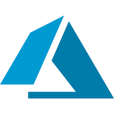
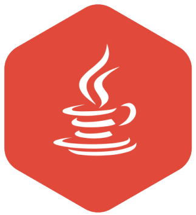
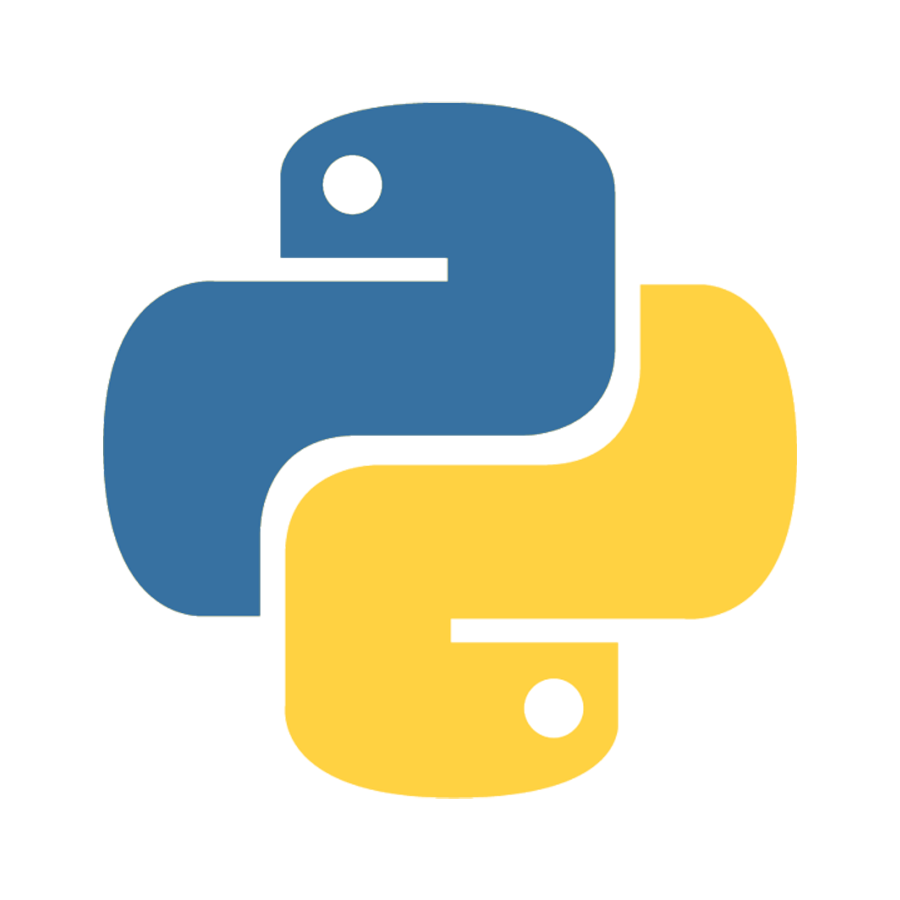
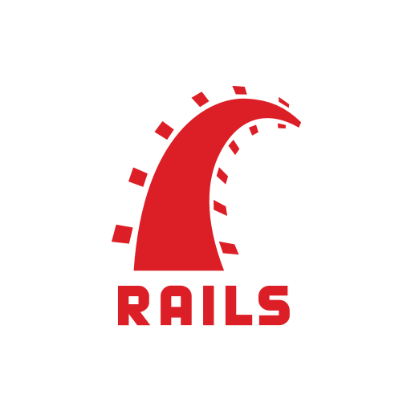
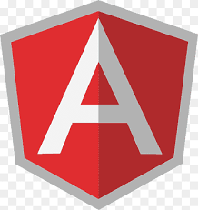

# Tiago Iwamoto (Iwa)

Profissional de Tecnologia da Informação com sólida experiência em desenvolvimento de software, análise de sistemas e liderança técnica. 
Especializado em Java com Spring Boot, com conhecimentos em Python, Golang, Rust e Angular, atuando em ambientes de alta performance e escalabilidade. 
Reconhecido por sua capacidade de liderar equipes, implementar soluções eficientes e promover a melhoria contínua de processos e experiência internacional.
Formado em analise de sistemas, com pós graduação em arquitetura de sistemas java e inteligencia artificial, com mba em business intelligence e arquitetura cloud.

## Habilidades

<table>
    <tr>
        <td></td>
        <td></td>
    </tr>
    <tr>
        <td>AWS</td>
        <td>Azure</td>
    </tr>
</table>

<table>
    <tr>
        <td></td>
        <td></td>
        <td></td>
        <td></td>
    </tr>
    <tr>
        <td>Java</td>
        <td>Spring boot</td>
        <td>Golang</td>
        <td>Rust</td>
    </tr>
</table>

<table>
    <tr>
        <td></td>
        <td></td>
        <td></td>
    </tr>
    <tr>
        <td>Python</td>
        <td>Ruby</td>
        <td>Rails</td>
    </tr>
</table>

<table>
    <tr>
        <td></td>
        <td></td>
    </tr>
    <tr>
        <td>Angular</td>
        <td>Vuejs</td>
    </tr>
</table>

## Certificações
<table>
    <tr>
        <td align="center"></td>
        <td align="center"></td>
        <td align="center"></td>
    </tr>
    <tr>
        <td align="center">AWS Certified Cloud Practitioner</td>
        <td align="center">AWS Certified Solutions Architect – Associate</td>
        <td align="center">AWS Certified Developer – Associate</td>
    </tr>
    <tr>
        <td align="center"></td>
        <td align="center"></td>
        <td align="center"></td>
    </tr>
    <tr>
        <td align="center">Oracle Data Platform 2025 Certified Foundations Associate</td>
        <td align="center">Oracle Cloud Infrastructure 2025 Certified Foundations Associate</td>
        <td align="center">Oracle Cloud Infrastructure 2023 Multicloud Architect Certified Associate</td>
    </tr>
    <tr>
        <td align="center"></td>
        <td align="center"></td>
        <td align="center"></td>
    </tr>
    <tr>
        <td align="center">GitHub Foundations</td>
        <td align="center">Linux Essentials Certificate</td>
        <td align="center">Scrum Foundation Professional Certification</td>
    </tr>
    <tr>
        <td align="center"></td>
        <td align="center"></td>
        <td align="center"></td>
    </tr>
    <tr>
        <td align="center">White Belt</td>
        <td align="center"></td>
        <td align="center"></td>
    </tr>
</table>

<table>
    <tr>
        <td>Cursos</td>
        <td>Total Horas</td>
    </tr>
    <tr>
        <td>Treinaweb</td>
        <td>+2400 horas</td>
    </tr>
    <tr>
        <td>Alura</td>
        <td>+800 horas</td>
    </tr>
    <tr>
        <td>Udemy</td>
        <td>+200 horas</td>
    </tr>
    <tr>
        <td>Whizlabs</td>
        <td>+80 horas</td>
    </tr>
    <tr>
        <td>...</td>
        <td>+200 horas</td>
    </tr>
</table>

<h2>Status</h2>

<a href="https://github.com/tiagoiwamoto">

  

<h2>Contatos</h2>

   

